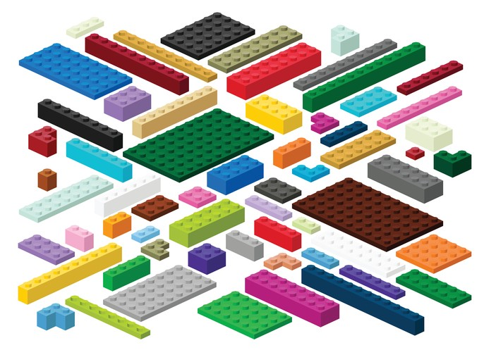

## Design Patterns
Initially, I had the impression that software design pattern refers to the visualization of an application. The word *design* had me perceiving that it was all about making an application pretty and pleasing to the eye. Turns out, design pattern refers to the use of repeatable solutions implemented for different situations within an application. Simply put, design patterns is like a template -- template helps keep things uniformed, efficient, and functional throughout.

On top of being oblivious of what design pattern was, I also didn't realize that I was already using design patterns on a lot of applications I have built. In fact, many of these applications utilizes at least three types of design patterns. Factory, Observer, and Model-View-Controller (MVC) are among the design patterns I have frequently used.

## Design Patterns in Job Match'UH
[Job Match'UH](https://github.com/Job-Match-UH) is the most recent application project I am working on where different types of design patterns are being used. Operated alongside four fellow talented computer science classmates, Job Match'UH is an application that provides UH students and recruiting companies to match with each other for employment opportunities. To successfully match students and company together, we have implemented the use of Singleton design pattern in which a number of collections are created to collect keywords to find the compatibility of each student to a company. Another design pattern used in this application are Prototypes. Developed in JavaScript, a number of classes are used in many of our pages in order to successfully render the objects created. Many other design patterns are used for this application, but Singleton and Prototypes are the most implemented.

## Leaving Comments On Your Code
Contrary to Design Patterns, Software AntiPattern is the use of ineffective solutions that leads to either no where or bigger issues. Of course, I have also experienced using AntiPatterns, unintentionally than I intend to, especially during the early stages of my major as a computer science. In most cases, I had fears of removing lines of code along the way, as I was skeptical deleting a certain line would completely crash the program. Although the program would run successfully, dead code would be visible in many parts of the program. One of my computer science professor, Daniel Kruse, would always say *"Write comments on your code because humans are susceptible to forgetfulness. Be the hero for your future self."* Leaving comments on my code has definitely decreased the practice of implementing AntiPatterns, as the comments would help me understand what certain lines of code does to the program. After all, I refer to my programs as notes for review, and having comments definitely makes it much easier to understand what the code does.
