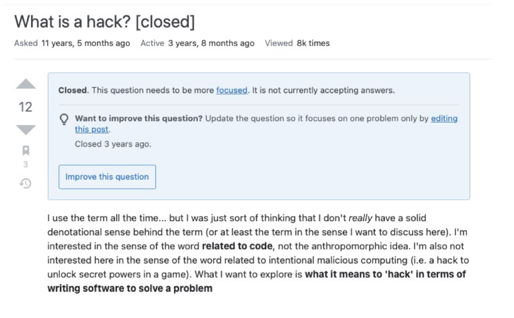

## Technical Questions

  Asking questions are always encouraged, no matter how ridiculous they may be. It always leads you to a newfound knowledge, expanding to even more questions that you want to know more about. There is no such thing as dumb questions -- it is only then perceived as dumb based on how the question was delivered. Eric Raymond's [How to Ask Questions The Smart Way](http://www.catb.org/esr/faqs/smart-questions.html) exhibits why tailoring questions into a smart way are important and more effective in leading you to the solution you are looking for.  
  
  Before crafting the question, you have to ask yourself, "Has someone asked this question before?". Because in most cases, someone may have already asked the same question, to which you can easily acquire the information they have discovered. However, although it may be rare, you may stumble a situation where you can't find the solution, and begin to believe that no one has ever been in the same situation as you before. In such case, Eric suggests to carefully determine the right platform/forum in order to deliver the question to the right audience. When posting the question, Eric advises to avoid doing: 
  - posting a question to an off-topic forum
  - posting an 'elementary' question where an advanced questions are rather expected
  - cross-posting on multiple platforms
  - posting a personal email to someone who isn't personally obligated in solving the problem for you 
  
## Smart Way 
  
  The best way to curate a smart question is to provide a specific description of what you are trying to tackle. Doing so can provide people a general idea of what you are specifically trying to get to. Along with that, it is also a best practice to provide a description of the different approaches you've already tried doing. That way, people don't provide an approach you've already done. One example of a smart curated question is [this](https://stackoverflow.com/questions/64791035/cant-run-jupyter-notebook-with-python-3-9-env) issue that deals with not being able to run a software through a specific environment. The subject line already provides a concise yet specific problem that the person is encountering. The post delves into the specifity of the different approaches they've already tried doing, and provided the the type of errors presented.  
  
##   
  
  

## Not So Smart Way

  It is inevitable to encounter posts that seem to be irrelevant from the platform it is posted in. This example exhibits the 'not so smart way' to ask a question. By Eric's suggestion as described above, [this example](https://stackoverflow.com/questions/3527174/what-is-a-hack?noredirect=1&lq=1) exhibits how it is posted to an off-topic forum and an 'elementary' type of question. As a result, the question is flagged as 'Closed' on the platform as it is not relevant to the type of questions that should be asked. 
  

  
  
  
## Questions, Questions, Questions

  Although there is no such thing as dumb questions, questions can be easily classified into two categories: the 'Smart Way' and the 'Not So Smart Way'. A smart question has well thought out elements such as providing an explanation of the problem, the solutions that have been tried, and what type of end goal they are trying to obtain. Questions that have this level of detail does not waste anyone's time and instead, creates a specificty needed to be answered quickly. So the next time you need help on a technical problem, consider curating your question into a 'Smart Way'. 
  
  
  
  
  
  
  
  
