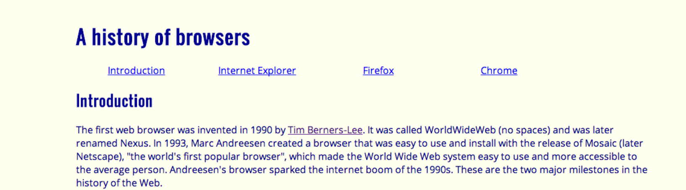
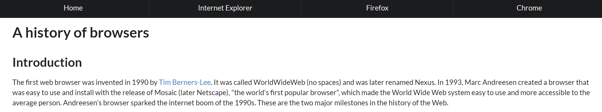

## Front-end Development

Front-end requires developing websites that are user-interactive and eye appealing. The use of Semantic UI allows software engineers to develop a more modern-like websites, hindering from a site looking like it was created in the 90s. A well designed website creates great impressions and a sense of credibility from site viewers, and Semantic UI provides that. Semantic UI reminds me of makeup -- you don't need it to look pretty, but it can help enhance your physical attributes.

Semantic UI is the first UI Framework I have used when designing a website. I was completely oblivious to its existence prior to my class' introduction. I thought modern existing websites were merely developed from raw HTML and CSS alone. I was completely amazed with the power of UI Frameworks. It instantly made my websites much more appealing from just the implementation of ui classes.

Without Semantic UI:
 

With Semantic UI:
 

## Simplicity
Transforming modern-like websites was much more easier than I anticipated. I thought it required an extensive amount of code in order to curate a non-outdated design. Through Semantic UI, I just had to wrap my code around 
 class="ui..."
 in order to do so. How easy, right?

Recreating websites with Semantic UI has especially been really fun for me. The ability to develop web designs similar to current online platforms is so rewarding. Makes me realize what a great skill it truly is to know how to develop a website that not only is functional, but pretty as well. It is motivating to learn and improve on these skills, and be able to present them to others. Maybe I'll be able to develop my own cool website someday. Stay tuned! 
