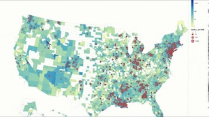

## COVID Cases
During the first year of the pandemic, it was a common practice to go on search engines and look up the number of cases that was surging around us. The constant incline with the amount of people who tested positive for Covid kept everyone on edge. We were all scared of physical interactions, having a constant fear that we might have acquired the virus. I was one of them. I was among the people that were scared. I was skeptical about everything -- whom I talked to, where I went, and what I touched. Sanitizing everything became a part of my daily routine. Even after coming home, I would quickly go to the bathroom to shower, then proceed to spray the clothes that I wore outside with Lysol spray. It was ridiculous. I didn't realize back then that the pandemic was giving me an anxiety.

Over Fall semester of 2020, I took up on taking an Intro to Data Science at Maui College for fun. I surprisingly enjoyed the class more than I expected, that it became the foundation to my curiosity in the Data Science field. Given the situation that we were in, the professor suggested that we make a project that tracks the number of Covid cases in our desired locations. Due to my anxiety, I was curious with the amount of cases there is in the United States, and even in other countries. I was curious as to which country was doing bad, and which one was doing good. 

## How I did it

Through John Hopkins' repository on GitHub, I acquired the data of the number of cases there is. Using Python, I went through the process of cleaning and minimizing the data to fit the criteria that I only need in the project. I then decided to incorporate geopandas to create a geospatial data that would make the visuals easy to comprehend as possible. With it, you can determine the difference in the cases for each region.

## What I came out of it
Developing a timed series data through Python was really fun. It was my first time using the language, and I picked up the language after numerous Youtube tutorials and hundreds of questions to my professor. I think I was particularly so interested in creating the timed series data because we were conducting a study that is occuring at the present time. And in doing so, I felt as if I became more knowldgeable with the Covid cases. It made me feel reassured, because I was able to make predictions based on the data. Having acquired the knowledge ultimately helped me with my anxiety from Covid.  

